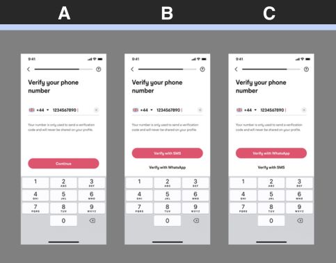
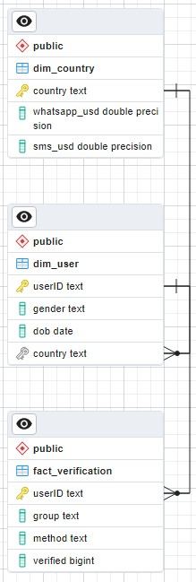

# Growth Data Analyst Exercise: Project for Muzz

## Overview

This project focuses on analysing verification success rates across three test (see picture 1 below) groups using SMS and WhatsApp as verification methods. The goal is to evaluate the effectiveness of these methods, understand user preferences, and recommend strategies to optimise the verification process.

The project explores the performance of different verification methods, considering both user behaviour and cost-efficiency, with the aim of enhancing user experience and increasing verification success rates.

 

**Picture 1. New in-app screen study**


## Project Structure

- **`.gitignore`**: Specifies files and directories to be ignored by Git version control (private).
- **`README.md`**: This file, providing an overview of the project.
- **`00_data_cleanup_and_starschema_constraints.sql`**: SQL script for data cleanup and enforcing schema constraints.
- **`01_memo.md`**: A memo summarising key observations and analysis results.
- **`02_report_growth_data_analyst_exercise.ipynb`**: Jupyter notebook detailing the growth data analysis exercise and verification method evaluations.
- **`02_report_growth_data_analyst_exercise.sql`**: SQL script to extract data for the growth data analysis exercise.
- **`03_report_verification_and_cost_analysis.sql`**: SQL report focusing on the verification methods and associated costs.
- **`04_age_bracket_method_failure_rates.sql`**: SQL script examining failure rates based on user age brackets.
- **`05_drop_tables.sql`**: SQL script to drop tables in the database when needed.
- **`data_extraction.py`**: Python script for extracting necessary data from the database.
- **`database_utils.py`**: Utility functions for interacting with the database.
- **`db_creds.yaml`**: File storing database credentials (private).
- **`LICENSE.mb`**: Project Licence
- **`main.py`**: The main Python script that orchestrates the data processing and analysis tasks.
- **`__pycache__`**: Folder containing cached Python bytecode files (private).
- **`.vscode`**: Visual Studio Code project configuration folder (private).
- **`muzz_files/`**: Folder containing project-specific data, including `product_data_analyst_data_2024/`.
- **`other/`**: Folder containing README-specific data, including `README_pics/` and `sql_outputs` containing saved queries from .sql scripts. 
- **`requirements.txt`**: A file listing all the required Python packages for the project.



**Picture 2. Entity-Relationship Diagram (ERD) for the `muzz_project` database in `pgAdmin 4`**

## Verification Methods and Test Groups

### Group A: SMS-Only
- **Method**: SMS Verification Only
- **Success Rate**: 0.8735
- **Description**: This group received SMS as the only available verification method, and the success rate was comparatively lower, suggesting that providing only one method may limit verification success.

### Group B: SMS > WhatsApp
- **Methods**: SMS (Primary) and WhatsApp (Secondary)
- **Success Rate**: SMS (0.9298), WhatsApp (0.9144)
- **Description**: In this group, SMS was offered as the primary verification method, with WhatsApp as the secondary method. SMS had a higher success rate and represented 88.76% of interactions, while WhatsApp accounted for 11.24% of interactions. This setup indicates that providing a fallback option can improve overall success.

### Group C: WhatsApp > SMS
- **Methods**: WhatsApp (Primary) and SMS (Secondary)
- **Success Rate**: WhatsApp (0.9140), SMS (0.9535)
- **Description**: WhatsApp was the primary verification method, with SMS as the secondary option. Despite WhatsApp being the preferred method (63.83% of interactions), SMS showed the highest success rate of all methods, particularly when used as the secondary option. This suggests that a dual-method approach is more effective.

## Insights

- **Highest Success Rate**: Group C (WhatsApp > SMS) shows the highest success rate at 0.9282, closely followed by Group B (SMS > WhatsApp) at 0.9281.
- **Lowest Success Rate**: Group A (SMS-only) has the lowest success rate at 0.8735, indicating that including an alternative verification method may improve outcomes.
- **Dual-Method Setup**: Offering two verification methods increases success rates. Groups B and C, which allow for both SMS and WhatsApp, demonstrated higher success than Group A (SMS-only).
  
## Key Findings

- **SMS outperforms WhatsApp**: Within Groups B and C, SMS consistently achieves higher success rates than WhatsApp, particularly in Group C.
- **User Preferences**: Users tend to favour the first verification method offered, with WhatsApp being more popular in Group C and SMS in Group B.

## Additional Analysis (Future Work)

If more data were available, additional analysis could be conducted on:
- **Cost-Benefit Analysis by Region**: Evaluate the cost-effectiveness of each method by region.
- **Demographic Insights**: Understand how user age, device type, and other demographics influence verification success rates.
- **Time-of-Day Analysis**: Analyse verification success based on time of day or day of the week.
- **Impact of Network Connectivity**: Assess the influence of network strength and Wi-Fi availability on verification success.
- **User Feedback**: Incorporate user feedback to further refine the verification process.

## Recommendations

- **Dual-Method Approach**: The results suggest that offering both SMS and WhatsApp as verification methods increases the likelihood of success.
- **Prioritise SMS as a Fallback**: SMS tends to outperform WhatsApp in verification success, especially when used as a secondary option.
- **Highlight SMS as a Reliable Option**: Given its higher success rate, SMS should be recommended as a fallback method.

## Setup and Installation

From the main/root directory of the project folder, follow these steps. Clone the repository:

1. cd into the directory and then in the command line:
    ```bash
    git clone https://github.com/chemi5t/chemi5t-muzz-growth-data-analyst.git
    ```
2. Set up a virtual environment for the project:
    ```bash
    conda create --name muzz_env2
    ```
    ```bash
    conda activate muzz_env2
    ```
3. Install the required Python packages via the [requirments.txt](requirements.txt) file:
    ```bash
    pip install -r requirements.txt
    ```
4. Set up a `PostgreSQL` database named `muzz_project` using a client of your choice i.e. `pgAdmin 4` or connect via SQLTools to the database. 
5. Save your database credentials to `db_creds.yaml` for security and to enable data upload postgrSQL.
6. Run main.py script file to extract folder containing tables to local.
    ```bash
    python main.py
    ```
    Then execute files:
    1. 00_data_cleanup_and_starschema_constraints.sql   <--- copy into i.e. pgAdmin 4 and run
    2. 02_report_growth_data_analyst_exercise.sql       <--- copy into i.e. pgAdmin 4 and run
    3. 03_report_growth_data_analyst_exercise.ipynb     <--- runs Jypter notebook and connects to SQLTools , allowing you to make queries directly
    4. 04_age_bracket_method_failure_rates.sql          <--- copy into i.e. pgAdmin 4 and run

# Contributing
If you'd like to contribute to this project, feel free to fork the repository, make changes, and submit a pull request. All contributions are welcome!

# Languages

- Python
- SQL

# License
This project is licensed under the terms of the [MIT License](LICENSE.md). Please see the [LICENSE.md](LICENSE.md) file for details.

# Future Work

This project is an ELT data pipeline. In the future I shall make this an ETL data pipeline and perform the clean up in-line with extraction prior to uploading to the database. Further automating the process. 


### Key Changes:
1. **Group and Method Breakdown**: I've added detailed explanations of each test group and the methods used (SMS-only, SMS > WhatsApp, WhatsApp > SMS), along with their respective success rates.
2. **Insights and Key Findings**: Clarified the results for each group and method to provide a clearer summary of the analysis.
3. **Recommendations**: Focused on actionable recommendations based on the success of different methods.